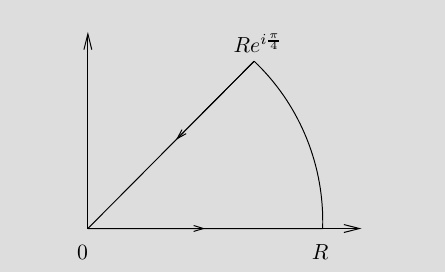

# Stein And Shakarchi

## 2.6.1

Show that
\begin{align*}
\int_{0}^{\infty} \sin \left(x^{2}\right) d x=\int_{0}^{\infty} \cos \left(x^{2}\right) d x=\frac{\sqrt{2 \pi}}{4}
.\end{align*}

> Hint: integrate $e^{-x^2}$ over the following contour, using the fact that $\int_{-\infty}^{\infty} e^{-x^{2}} d x=\sqrt{\pi}$:

\

## 2.6.2

Show that

\begin{align*}
\int_{0}^{\infty} \frac{\sin x}{x} d x=\frac{\pi}{2}
.\end{align*}

> Hint: use the fact that this integral equals $\frac{1}{2 i} \int_{-\infty}^{\infty} \frac{e^{i x}-1}{x} d x$, and integrate around an indented semicircle.

## 2.6.5

Suppose $f\in C_\CC^1(\Omega)$ and $T\subset \Omega$ is a triangle with $T^\circ \subset \Omega$.
Apply Green's theorem to show that $\int_T f(z) ~dz = 0$.

Assume that $f'$ is continuous and prove Goursat's theorem.

> Hint: Green's theorem states

\begin{align*}
\int_{T} F d x+G d y=\int_{T^\circ}\left(\frac{\partial G}{\partial x}-\frac{\partial F}{\partial y}\right) d x d y
.\end{align*}

## 2.6.6

Suppose that $f$ is holomorphic on a punctured open set $\Omega\setminus\theset{w_0}$ and let $T\subset \Omega$ be a triangle containing $w_0$.
Prove that if $f$ is bounded near $w_0$, then $\int_T f(z) ~dz = 0$.

## 2.6.7

Suppose $f: \DD \to \CC$ is holomorphic and let $d \definedas \sup_{z, w\in \DD}\abs{f(z) - f(w)}$ be the diameter of the image of $f$.
Show that $2 \abs{f'(0)} \leq d$, and that equality holds iff $f$ is linear, so $f(z) = a_1 z + a_2$.

> Hint: $2f'(0) = \frac{1}{2\pi i} \int_{\abs \xi = r} \frac{ f(\xi) - f(-\xi)  }{\xi^2} ~d\xi$ whenever $0<r<1$.

## 2.6.8

Suppose that $f$ is holomorphic on the strip $S = \theset{x+iy \suchthat x\in \RR,~ -1<y<1}$ with $\abs{f(z)} \leq A \qty{1 + \abs z}^\nu$ for $\nu$ some fixed real number.
Show that for all $z\in S$, for each integer $n\geq 0$ there exists an $A_n \geq 0$ such that $\abs{f^{(n)}(x)} \leq A_n (1 + \abs x)^\nu$ for all $x\in \RR$.

> Hint: Use the Cauchy inequalities.

## 2.6.9

Let $\Omega \subset \CC$ be open and bounded and $\phi: \Omega \to \Omega$ holomorphic.
Prove that if there exists a point $z_0 \in \Omega$ such that $\phi(z_0) = z_0$ and $\phi'(z_0) = 1$, then $\phi$ is linear.

> Hint: assume $z_0 = 0$ (explain why this can be done) and write $\phi(z)  = z + a_n z^n + O(z^{n+1})$ near $0$.
  Let $\phi_k = \phi \circ \phi \circ \cdots \circ \phi$ and prove that $\phi_k(z) = z + ka_nz^n  + O(z^{n+1})$.
  Apply Cauchy's inequalities and let $k\to \infty$ to conclude.

## 2.6.10

Can every continuous function on $\bar \DD$ be uniformly approximated by polynomials in the variable $z$?

> Hint: compare to Weierstrass for the real interval.

## 2.6.13

Suppose $f$ is analytic, defined on all of $\CC$, and for each $z_0 \in \CC$ there is at least one coefficient in the expansion $f(z) = \sum c_n(z-z_0)^n$ is zero.
Prove that $f$ is a polynomial.

> Hint: use the fact that $c_n n! = f^{(n)}(z_0)$ and use a countability argument.

## 2.6.14

Suppose that $f$ is holomorphic in an open set containing $\DD$ except for a pole $z_0 \in \bd \DD$.
Let $\sum a_n z^n$ be the power series expansion of $f$ in $\DD$, and show that $\lim \frac{a_n}{a_{n+1}} = z_0$.

## 2.6.15

Suppose $f$ is continuous, nonvanishing on $\bar \DD$, and holomorphic in $\DD$.
Prove that if $\abs{z} = 1 \implies \abs{f(z)} = 1$, then $f$ is constant.

> Hint: Extend $f$ to all of $\CC$ by $f(z) = 1/ \bar{f(1/\bar z)}$ for any $\abs{z} > 1$, and argue as in the Schwarz reflection principle.

# Additional Problems

## Problem 1

Proposition:
$L = \lim \abs{a_{n+1}}/\abs{a_n} \implies L = \lim \sqrt[n]{a_n}$

## Problem 2

Proposition:
If $f$ is a power series centered at the origin, then $f$ has a power series expansion about any point in its domain.

## Problem 3

### a

Proposition:
$\sum n z^n$ does not converge for any $\abs{z} \leq 1$.

### b

Proposition:
$\sum z^n/n^2$ converges for every $\abs{z} \leq 1$.

### c

Proposition:
$\sum z^n/n$ converges for every $\abs{z}\leq 1$ except $z=1$.

## Problem 4

Proposition:
Let $\gamma$ denote a circle centered at the origin of radius $r$ with positive orientation.
Then if $\abs \alpha \leq r \leq \abs \beta$,

\begin{align*}
\int_{\gamma} \frac{d z}{(z-\alpha)(z-\beta)}=\frac{2 \pi i}{\alpha-\beta}
.\end{align*}

## Problem 5

Proposition:
Suppose $x$ is continuous in the region $(x,y) \in [x_0, \infty) \cross i[0, b] \subset \RR \oplus i\RR$, and $\lim_{x\to\infty} f(x + iy) = A$ independent of $y$.
Let $\gamma = \theset{z=x+it \suchthat 0\leq t \leq b}$, then

\begin{align*}
\lim _{x \rightarrow+\infty} \int_{\gamma_{x}} f(z) d z=i A b
.\end{align*}

## Problem 6

Show that there exists a function $f$ that is holomorphic on $0 < \abs z < 1$ with $\int_{\bd D_r(0)} = 0$ for all $r<1$ but $f$ is not holomorphic at $z=0$.

## Problem 7

Let $f$ be analytic on $\Omega$ and $f'(z_0) \neq 0$ for some $z_0 \in \Omega$.
Show that if $C$ is a circle centered at $z_0$ of sufficiently small radius, then

\begin{align*}
\frac{2 \pi i}{f^{\prime}\left(z_{0}\right)}=\int_{C} \frac{d z}{f(z)-f\left(z_{0}\right)}
.\end{align*}

## Problem 8

Let $u, v \in C^1(\RR^2)$.
Show that $f = u + iv$ has derivative $f'(z_0) = x_0 + iy_0$ iff

\begin{align*}
\lim _{r \rightarrow 0} \frac{1}{\pi r^{2}} \int_{\left|z-z_{0}\right|=r} f(z) d z=0
.\end{align*}

## Problem 9

Let $\gamma$ be piecewise smooth with interior $\Omega_1$ and exterior $\Omega_2$.
Assume $f'$ exists on an open set containing $\gamma$ and $\Omega_2$.
Show that if $\lim_{z\to\infty}f(z) = A$, then

\begin{align*}
\frac{1}{2 \pi i} \int_{\gamma} \frac{f(\xi)}{\xi-z} d \xi=\left\{\begin{array}{ll}{A,} & {\text { if } z \in \Omega_{1}} \\ {-f(z)+A,} & {\text { if } z \in \Omega_{2}}\end{array}\right
.\end{align*}

## Problem 10

Let $f$ be bounded and analytic and $a\neq b \in \CC$ be fixed, then the following limit exists:

\begin{align*}
\lim _{R \rightarrow \infty} \int_{|z|=R} \frac{f(z)}{(z-a)(z-b)} d z
.\end{align*}

Conclude that $f$ must be constant.

## Problem 11

Suppose $f$ is entire and $\frac{f(z)}{z} \converges{z\to\infty}\to 0$.
Show that $f$ is constant.

## Problem 12

Let $f$ be analytic on $\Omega$ and $\gamma$ a closed curve in $\Omega$.
Show that for any $z_0 \in \Omega\setminus \gamma$,

\begin{align*}
\int_{\gamma} \frac{f^{\prime}(z)}{\left(z-z_{0}\right)} d z=\int_{\gamma} \frac{f(z)}{\left(z-z_{0}\right)^{2}} d z
.\end{align*}

## Problem 13
Compute

\begin{align*}
\int_{|z|=1}\left(z+\frac{1}{z}\right)^{2 n} \frac{d z}{z}
.\end{align*}

Use this to show that 

\begin{align*}
\int_{0}^{2 \pi} \cos ^{2 n} \theta d \theta=2 \pi \frac{1 \cdot 3 \cdot 5 \cdots(2 n-1)}{2 \cdot 4 \cdot 6 \cdots(2 n)}
.\end{align*}

